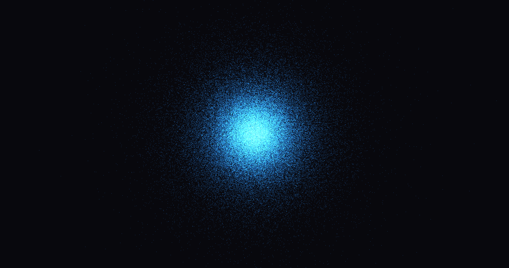
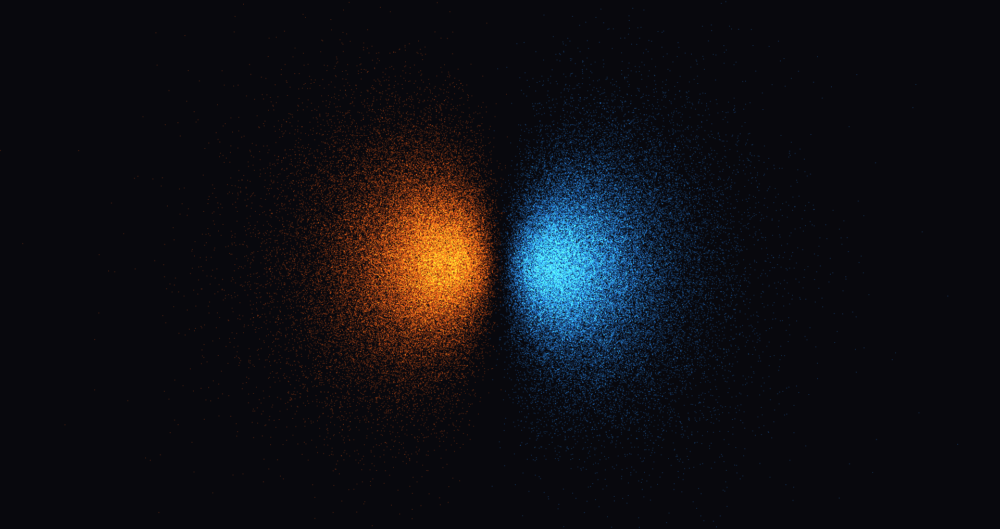
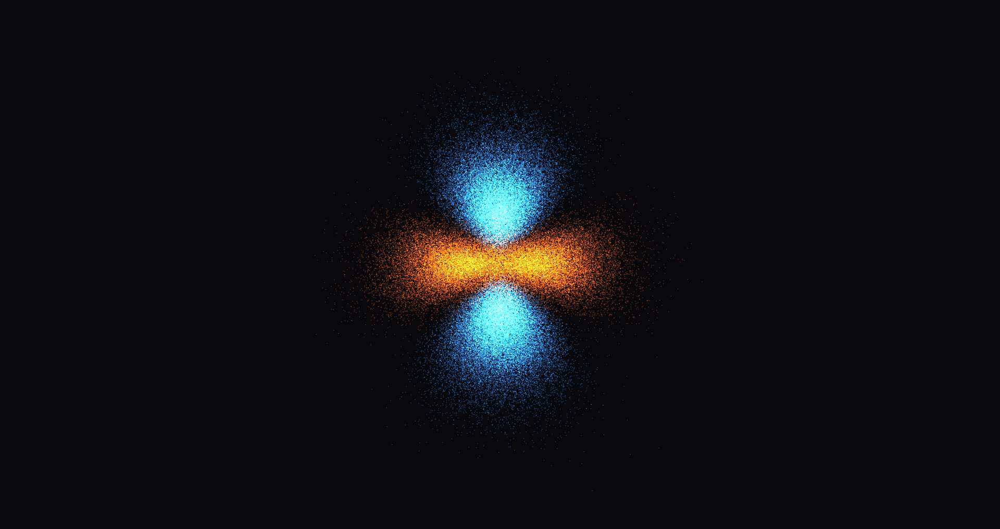
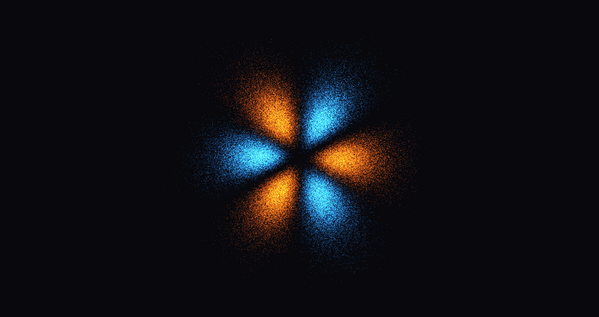

# Drawing orbitals

What we would like to do is to solve the time-indipendent Schrodinger equation, which can be obtained in the following way: let us consider a time-indipendent $\hat{H}(t)$ (which means that $\forall t, t', ([\hat{H}(t), \hat{H}(t')] = \hat{0})$) and suppose that $\{ \ket{\epsilon_n } \}$ is a complete basis of eigenket of the operator $\hat{H}(t)$ of the Hilbert space describing a physical system. So we have that
$$
    \hat{H} \ket{\epsilon_n} = E_n \ket{n} \implies \bra{\vec{x}} \hat{H} \ket{\epsilon_n} = E_n \braket{\vec{x} | \epsilon_n },
$$
if we are considering an Hamiltonian of the form
$$
    \hat{H} = \frac{\hat{P}^2}{2m} + V(r),
$$
then we have that
$$
    \bra{x} \hat{H} \ket{\epsilon_n} = \left[ - \frac{\hslash^2}{2m} \nabla^2 + V(r) \right] \braket{\vec{x} | \epsilon_n}, 
$$
and defining $\braket{\vec{x} | \epsilon_n} = \psi_n(\vec{x})$ as the wavefunction of the eigenket $\ket{\epsilon_n}$, we have that
$$
\left[ - \frac{\hslash^2}{2m} \nabla^2 + V(r) \right] \psi_n(\vec{x}) = E_n \psi_n(\vec{x}).
$$

By recalling that the laplacian in spherical coordinates is simply
$$
    \nabla^2 = \frac{1}{r} \frac{\partial^2 r}{\partial r^2} + \frac{1}{r^2 \sin{\theta}}\frac{\partial^2 (\cos{\theta})}{\partial \theta^2} + \frac{1}{r^2 \sin{\theta}} \frac{\partial^2}{\partial \phi^2}
$$
and orbital angular momentum has the following representation in $L^2$,
$$
    \hat{L}^2 = -\hslash^2 \left( \frac{\partial^2}{\partial \theta^2} + \cot{\theta} \frac{\partial}{\partial \theta} + \frac{1}{\sin^2{\theta}} \frac{\partial^2}{\partial \phi^2} \right),
$$
we have that
$$
    \left[ - \frac{\hslash^2}{2m} \nabla^2 + V(r) \right] = \left[ - \frac{\hslash^2}{2m}\left(\frac{1}{r}\frac{\partial r}{\partial r^2} \right) +\frac{\hat{L}^2}{2mr^2} + V(r)\right].
$$
If our system has spherical simmetry (for example for a Coulombian potential), we have that is more simple to describe our system using spherical coordinates, which are given by the following set of equations
$$
    \begin{cases}
        r = \sqrt{x^2 + y^2 + z^2} \\
        \theta = \arctan{\frac{y}{x}} \\
        \phi = \arccos{\frac{z}{r}}
    \end{cases} \iff \begin{cases}
        x = r\cos{\theta} \sin{\phi} \\
        y = r\sin{\theta} \sin{\phi} \\
        z = r\cos{\phi}
    \end{cases}
$$
and if our system has spherical symmetry we know, thanks to Sturm-Liouville theory, that our solution can be written as
$$
    \psi(r, \theta, \phi) = R_{nl}(r) Y_{lm}(\theta, \phi),
$$
so, by inserting this ansatz in the equation and by recalling that $Y_{lm}(\theta, \phi)$ is a complete basis of eigenket of $\hat{L}^2$ and $\hat{L}_z$, we can reduce our problem to solve the following $1-$ dimensional problem
$$
    \left[ -\frac{\hslash^2}{2m} \frac{1}{r} \frac{\partial^2 \left( r R_{nl}(r) \right)}{\partial r^2} + \frac{\hslash^2 l(l+1)R_{nl}(r)}{2mr^2} \right] + V(r)R_{nl}(r) = \epsilon_n R_{nl}(r),
$$
from the theory we know that the solution of this equation is given by Laguerre polynomials. What we want to do is to solve numerically this equation and draw the orbitals, which are the region of space where the probability of finding the electron is more likely: what we'll do it's to simply create a *pdf* (density probability function) for spawning random points in the space.

## System dependencies

| Library | Version | Note |
|----------|----------|------|
| CMake    | ≥ 3.16   | Build system |
| GLFW     | ≥ 3.3    | Window + input |
| OpenGL   | ≥ 3.3    | Driver GPU |
| GLAD     | bundled  | Loader OpenGL |

## Build

```bash
cd directory_name_of_the_directory
mkdir build
cmake ..
make
./atom
```

# Controls

You can rotate the orbitals using the mouse

## Some images I have created




